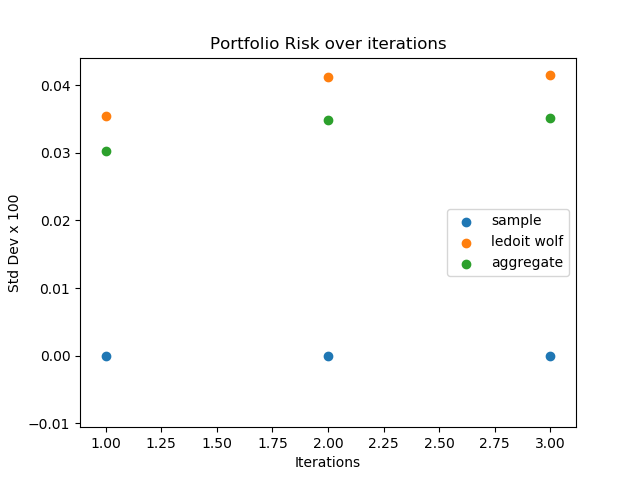
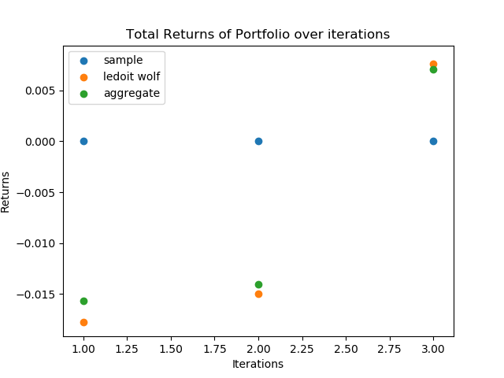

# Covariance Estimation Benchmarking System
## Nikhilesh Sankara Narayanan
### nikhilesh@yahoo.in

## Scope

The goal of this project is to showcase a robust system for estimating the co-variance matrix of a given portfolio’s returns, and to test the performance of the estimators by generating a Minimum Variance Portfolio (MVP) for each one and comparing their profitability and exposure to risk.

## Methodology

### *Estimation of Co-variance matrices:*

Three estimators of co-variance are used in this project. 
First, the sample co-variance matrix, which is an unbiased estimator of the true population co-variance matrix when number of observations (returns) is much larger than number of features (assets).

Second, a shrinkage co-variance estimator. The Ledoit-Wolf estimator from the scikit-learn library was used here.
Third, an aggregate estimator that combines the previous 2 estimators (equally weighted). This is an attempt to cover the flaws from the sample and shrinkage estimators by using a combination of the two.

Either Monthly or Daily data can be used for estimation, however daily data is more susceptible to noise.

### *Libraries Used:* 

* scikit-learn – For co-variance estimator functions 
* pandas – For data input and processing 
* NumPy – For Numerical and matrix calculations
* matplotlib – For plotting benchmark results

### *Benchmarking:*

The key idea is to train on historical data to estimate a co-variance matrix, and then generate a minimum variance portfolio from it. Then, based on future (out-of-sample) data, assess the performance of each MVP. The main benchmarks used to assess performance are:
1. Total portfolio value after out-of-sample period
1. Standard deviation of portfolio and each asset as a proxy for risk

One run of the benchmark takes in one in-sample period and one out-of-sample period. The co-variance matrix and the minimum variance portfolio weights are estimated on the in-sample data, and the total value of the portfolio and it’s standard deviation (as well as the standard deviated of each individual stock) are calculated at the end of the out-of-sample period.
This is repeated for successive periods. 

E.g. From starting time T:

*First iteration:* {T-10, T} is considered the in-sample and {T, T+1} the out-of-sample for the first run.

*Second iteration:* Now {T-9, T+1} is the in-sample period and {T+1, T+2} is the out-of-sample period.

Repeat for multiple iterations and chart the performance of each estimator against iterations.

## Class Structure

`DateRange:` Maintains in-sample and out-of-sample date ranges

`Estimator:` Used to process input file and estimate co-variance matrix from in-sample data based on the chosen estimator.

`Portfolio:` Generates minimum variance portfolio from Estimator object, and calculates its total value, standard deviation, and standard deviation of each asset at the end of the out-of-sample period.

`Benchmark:` The main driver class that creates Estimator and Portfolio objects and executes their functions, returning the performance metrics to be plotted.

## Assumptions

We assume the following:
* No constraints on the MVP (e.g. no short-selling)
* The number of observations is far larger than the number of stocks. Without this assumption, the sample co-variance matrix estimator (one of the baseline estimators) does not work.
* The return data is Independent and Identically Distributed.
* Data is inputted as a .csv file with the first column being ‘Date’ and the first row being labels. 

## Test Results

### *First test:*
Benchmarking the 3 estimators with parameters: 
* Daily Data
* In-sample data from 1/3/2007 to 12/31/2015
* Out-of-sample data from 12/31/2015 to 12/30/2016
* One benchmarking iteration

Estimator|Sample|Ledoit-Wolf|Aggregate
---------------------------------------
Total Return|-9.3 * 10-8|0.008289|0.00748

Portfolio Risk (S.D.)|7.58 * 10-9|0.000389|0.00033

Repeating the above benchmark but using Monthly return data:

Estimator|Sample|Ledoit-Wolf|Aggregate
---------------------------------------
Total Return|2.138 * 10-8|0.006816|0.006254

Portfolio Risk (S.D.)|2.0123 * 10-8|0.002975|0.002399

The Ledoit-Wolf estimator gave a net higher return but also exposed the portfolio to more risk than the minimum-variance portfolio calculated from the sample co-variance matrix.

### *Second test:* Benchmarking with parameters:
* Monthly Data
* In-sample data from 1/3/2007 to 12/31/2013 (6 years)
* Out-of-sample data for the next 1 year
* Updated in-sample data from 1/2/2008 to 12/31/2014 (6 years)
* Repeat for 3 iterations until end of 2016.
The results are then charted for 3 years of out-of-sample data, and you can see which estimator produced the most returns and had the least volatility. This is just one sample test – many more can be produced using the script. A chart of the output is shown below:
  

## Possible Extensions/Improvements

* Currently  the program only considers three different types of estimators. Other estimators can easily added– all that needs to be done is to implement the estimation function and update the functions list in class Estimator. I had actually started implementing a Constant Correlation Estimator, but could not complete it in time. In addition, I suspect a bug in the sample co-variance matrix as its results are quite dissimilar.

* The Class Design can be improved by using Inheritance ; where each estimator derives common properties from a Parent Estimator class, so that adding/updating one estimator does not require accessing the classes of the other ones.

* The system is flexible enough that additional estimators can be benchmarked with minimal effort. Further benchmarking using Sharpe/Sortino Ratio for each portfolio (and other similar performance/risk metrics) as well as timing analysis (to determine computational cost) could be added.

* The benchmarking test2() function currently hardcodes its iterations and the dates for in-sample and out-of-sample data. Ideally this would be automated for the structure given under the Methodology-Benchmarking section above with only start dates, end dates, and durations being parameterized.

* An option for weekly data frequency could be added in the same way monthly frequency was implemented.

* Theoretically, the estimators can be benchmarked using sample data of a known distribution without having to create a portfolio. However, I opted to benchmark them using a more practical application.

* Finally, given the class structure the program would normally be separated into separate modules/files but to maintain simplicity they are all implemented in the same script.

## References

1. *Honey, I Shrunk the Sample Covariance Matrix* - Olivier Ledoit, 2003

1. *Estimating the Covariance Matrix for Portfolio Optimization* - David J. Disatnik & Simon Benninga

1. *Risk Reduction In Large Portfolios: Why Imposing The Wrong Constraints Helps* - Ravi Jagannathan & Tongshu Ma

1. *Estimating Covariance Matrices for Portfolio Optimization* - Guillaume Coqueret & Vincent Milhau

